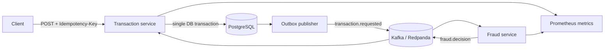

# LedgerGuard

Event-driven payment authorization and explainable fraud screening built with
Java 17, Quarkus, Kafka-compatible streaming, PostgreSQL and Docker.

This is a personal portfolio project. It demonstrates production-oriented
engineering practices; it does not claim to be a certified payment processor.

## Why this project exists

The hard part of a payment flow is not the CRUD endpoint. It is preserving
consistency across a database and a message broker, handling duplicate requests,
making fraud decisions auditable, and exposing enough telemetry to operate the
system. LedgerGuard focuses on those failure modes.

## Architecture



### Services

| Component | Responsibility | Port |
| --- | --- | --- |
| `transaction-service` | Idempotent API, persistence, outbox and final status | 8080 |
| `fraud-service` | Deterministic risk policy and explainable decision | 8081 |
| PostgreSQL | Transactions and outbox | 5432 |
| Redpanda | Kafka-compatible event transport | 9092 |

## Engineering decisions

- Transactional outbox avoids the database/Kafka dual-write problem.
- Optimistic locking protects transaction status updates.
- `Idempotency-Key` makes client retries safe.
- Fraud results include a score and reasons; no opaque "AI" claim.
- Bean Validation protects the API boundary.
- Flyway owns schema evolution.
- Health, OpenAPI and Prometheus endpoints are enabled in both services.
- Domain rules are isolated from Quarkus and covered by unit tests.

The tradeoffs are documented in [`docs/adr`](docs/adr).

Kubernetes deployment manifests with probes and resource limits are available
under [`infra/k8s`](infra/k8s). They intentionally reference an external
database secret and externally managed Kafka/PostgreSQL services.

## Run locally

Requirements: JDK 17+, Docker and Docker Compose.

```bash
./gradlew clean test build
docker compose up --build
```

Create a transaction:

```bash
curl -X POST http://localhost:8080/api/v1/transactions \
  -H 'Content-Type: application/json' \
  -H 'Idempotency-Key: demo-001' \
  -d '{
    "accountExternalIdDebit": "ACC-100",
    "accountExternalIdCredit": "ACC-200",
    "amount": 125.50,
    "currency": "PEN",
    "country": "PE",
    "newBeneficiary": false
  }'
```

The initial response is `PENDING`. After the asynchronous decision, retrieve it:

```bash
curl http://localhost:8080/api/v1/transactions/{transactionId}
```

Useful endpoints:

- Transaction OpenAPI: `http://localhost:8080/q/openapi`
- Fraud OpenAPI: `http://localhost:8081/q/openapi`
- Health: `/q/health`
- Metrics: `/q/metrics`

Start optional Prometheus:

```bash
docker compose --profile observability up
```

## Risk policy

| Rule | Score |
| --- | ---: |
| Amount >= 10,000 | +55 |
| Amount >= 5,000 | +35 |
| New beneficiary | +25 |
| Country on the configured high-risk list | +45 |

Decision thresholds: `<40 APPROVE`, `40-69 REVIEW`, `>=70 REJECT`.

## Test strategy

```bash
./gradlew test
```

- Unit tests cover fraud thresholds and transaction invariants.
- Build-time checks compile all Quarkus wiring and configuration.
- The Docker stack provides a reproducible integration environment.

## Production hardening still required

- OAuth2/OIDC and service-to-service authorization.
- Schema Registry with Avro or Protobuf compatibility rules.
- Outbox row claiming for multiple publisher replicas.
- Broker TLS/SASL, secret management and encrypted database volumes.
- Load tests, SLOs, alert rules and a multi-zone deployment.

These are kept explicit so the repository remains technically honest and useful
in architecture discussions.
